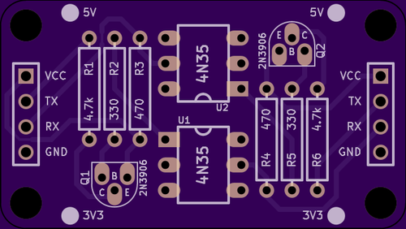

# 4N35-TTL-Serial-Optoisolator
A board for isolating a TTL serial RX / TX pair using 4N35 (6-pin) optoisolators.

# Status

This board is untested.

# Board design v1

Initial board design.

## Gerbers

[gerbers.zip](releases/v1/gerbers.zip)

## Schematic

[PDF](releases/v1/4N35-TTL-Serial-Optoisolator%20schematic.pdf).

# License

This board design is [Open-Source Hardware](http://www.oshwa.org/definition/).  It is licensed under the [MIT License](http://opensource.org/licenses/MIT).  It was designed by Jason Pepas.

